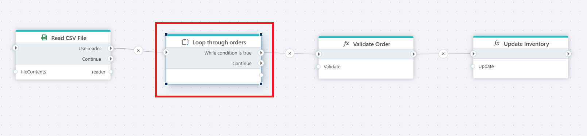

# DataReader iterator

Iterates through all records in a [DataReader](../csv/open-csv-file-as-datareader.md).

Use this action if you have a DataReader where you need to perform one or more custom operations on each record in the DataReader.

**Example**

This flow can be used to read and process customer orders from a [CSV file](../csv/open-csv-file-as-datareader.md), applying two actions to each record (e.g., validating the order and updating inventory). Read more about [Function](../built-in/function.md).

## Returns

Returns a [DataReader](../csv/open-csv-file-as-datareader.md) record.

## Properties

| Name                      | Type | Description                                                                       |
| ------------------------- | --------- | --------------------------------------------------------------------------------- |
| Title                     | Optional  | The title or name of the action.                                                 |
| Data reader               | Required  | Select the source DataReader.                   |
| DataReader variable name  | Optional  |   The name of the DataReader variable that contains the list of the objects names.    |
| Description               | Optional  | Additional notes or comments about the action or configuration.                   |