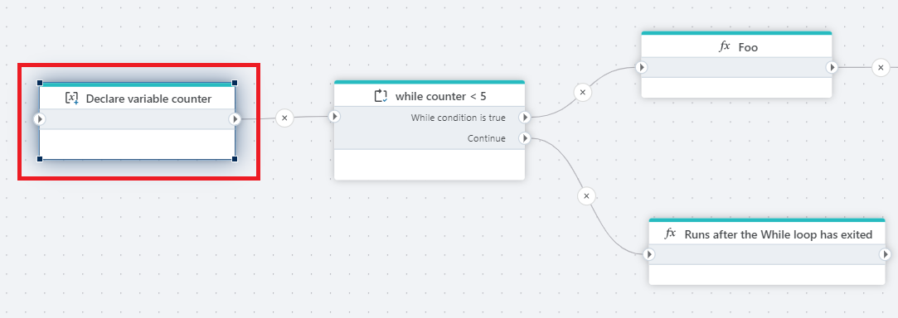

# Declare variable

Declares a variable to store data while the Flow is executing.

- You can declare as many variables as you want
- A variable can be either `global` or `local` (default). A `local` variable can only be used within the `scope` it is declared in. A `global` variable can be used in the entire Flow, both within [Functions](function.md) and Extension flowcharts.
- A variable cannot be referenced unless it is assigned a value. (It will not appear in variable selectors, for example, if you try to use it as an argument to a [Function](function.md)). Note that this is true for both `global` and `local` variables.

[Read more about variables in .NET here](https://learn.microsoft.com/en-us/dotnet/csharp/language-reference/language-specification/variables)

## Properties

| Name            | Type      | Description                                               |
|-----------------|-----------|-----------------------------------------------------------|
| Variable Name   | Optional  | The name of the variable.                                  |
| Data Type       | Optional  | The type of data the variable holds.                      |
| Initial Value   | Optional  | A value or a C# expression to initialize the variable.     |
| Global          | Optional  | Indicates whether the variable is global (default is not). |
| Description     | Optional  | A brief description of the variable's purpose.            |

