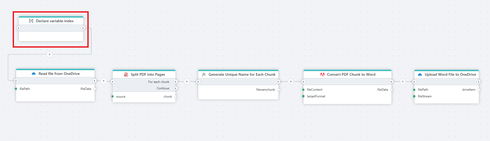
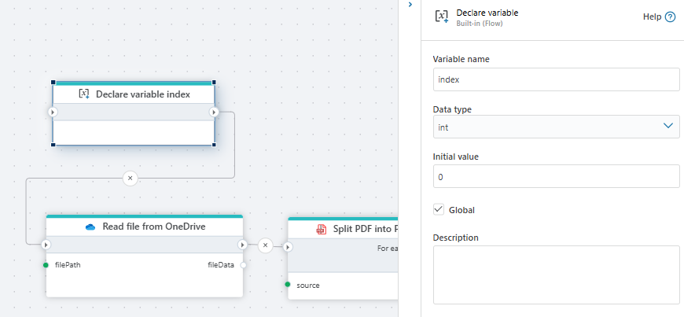
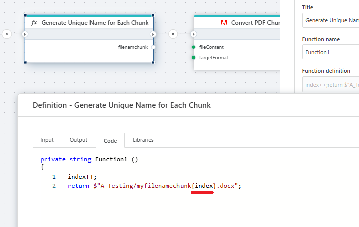
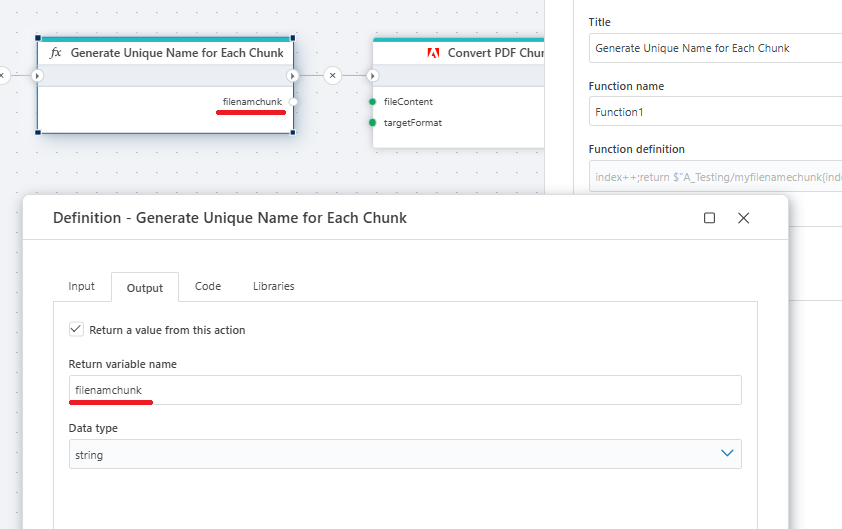

# Declare variable

Declares a variable to store data while the Flow is executing.

- You can declare as many variables as you want
- A variable can be either `global` or `local` (default). A `local` variable can only be used within the `scope` it is declared in. A `global` variable can be used in the entire Flow, both within [Functions](function.md) and Extension flowcharts.
- A variable cannot be referenced unless it is assigned a value. (It will not appear in variable selectors, for example, if you try to use it as an argument to a [Function](function.md)). Note that this is true for both `global` and `local` variables.

**Example**   
This flow reads a PDF file from [OneDrive](../onedrive/read-file-from-onedrive-as-byte-array.md), splits it into smaller chunks, assigns a unique name to each chunk ([function](function.md)), converts each chunk to a Word format, and uploads the resulting Word documents back to [OneDrive](../onedrive/upload-file-to-onedrive.md).

The variable initialized at the beginning of the flow (called index) is used to track and generate unique names for each chunk of the PDF after it's split.

When the PDF is split into multiple chunks (pages or groups of pages), each chunk must be saved and uploaded with a unique filename to avoid overwriting previous files and to maintain proper organization.

 We generate the variable first to start a counter (from 0) that we can increment for naming each file chunk.
 

 

 

> [!NOTE]
> Without this step, all chunks would have the same name, and only one file would remain on OneDrive.

 

[Read more about variables in .NET here](https://learn.microsoft.com/en-us/dotnet/csharp/language-reference/language-specification/variables)

## Properties

| Name            | Type      | Description                                               |
|-----------------|-----------|-----------------------------------------------------------|
| Variable Name   | Optional  | The name of the variable.                                  |
| Data Type       | Optional  | The type of data the variable holds.                      |
| Initial Value   | Optional  | A value or a C# expression to initialize the variable.     |
| Global          | Optional  | Indicates whether the variable is global (default is not). |
| Description     | Optional  | A brief description of the variable's purpose.            |

