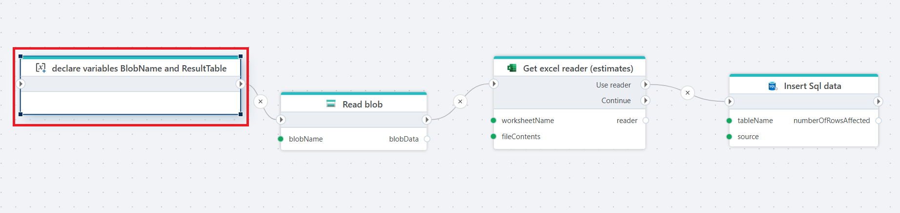

# Declare variables

Declares multiple variables simultaneously to store data while the Flow is executing.

- Variables can be either `global` or `local` (default). Local variables can be used only within the scope it is declared in. Global variables can be used in the entire Flow, including within [Functions](function.md) and Extension flowcharts.
- Each variable needs to have a Data Type to be valid. (If the Data Type is missing, it will not appear in variable selectors, for example, trying to use it as an argument to a [Function](function.md)). 

[Read more about variables in .NET here](https://learn.microsoft.com/en-us/dotnet/csharp/language-reference/language-specification/variables)

