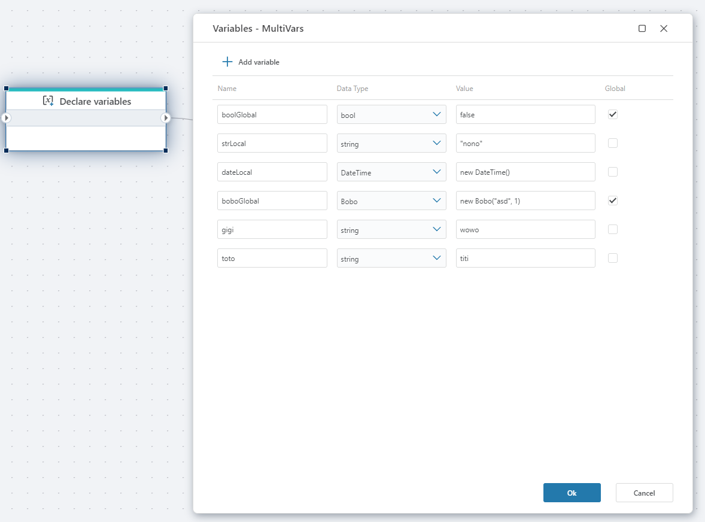

# Declare variables

Declares multiple variables simultaneously to store data while the Flow is executing.

- Variables can be either `global` or `local` (default). Local variables can be used only within the scope it is declared in. Global variables can be used in the entire Flow, including within [Functions](function.md) and Extension flowcharts.
- Each variable needs to have a Data Type to be valid. (If the Data Type is missing, it will not appear in variable selectors, for example, trying to use it as an argument to a [Function](function.md)). 

**Example**   
This Flow imports data from an Excel file stored in Azure Blob Storage and inserts it into a SQL table.

The Flow starts by declaring variables for the blob name (BlobName) and the destination SQL table (ResultTable).
It then reads the specified blob from Azure Blob Storage, retrieving the Excel file contents.
Next, the file content is passed to an Excel Reader, which opens a specific worksheet (in this case, estimates) and converts the rows into a structured data source.
Finally, the parsed Excel data is inserted into a SQL table using the Insert SQL Data action, which writes the rows and returns the number of affected records.

In short, this Flow automates the process of loading Excel data from Blob Storage into a SQL database, making it suitable for ETL scenarios such as importing estimates, reports, or batch data into a relational database. 

[Read more about variables in .NET here](https://learn.microsoft.com/en-us/dotnet/csharp/language-reference/language-specification/variables)

## Properties

| Name            | Type      | Description                                               |
|-----------------|-----------|-----------------------------------------------------------|
| Title                     | Optional  | The title or name of the action.                                                 |
| Variables   | Required  | Defined variables.                                  |
| Description     | Optional  | A brief description of the variable's purpose.            |

