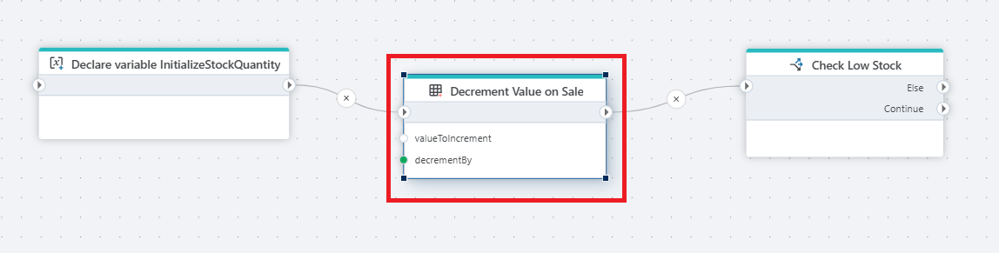

# Decrement value

Decrements a (numeric) value by a number.

 

## Returns
Returns a (numeric) value.

## Properties

| Name         | Data type       | Description                                       |
|--------------|-----------------|---------------------------------------------------|
| Title           | Optional | The title or name of the action.     |
| Variable to decrement         | Required   | The name of variable to decrement. |
| Decrement by   | Required      | The number to decrement by.   |
| Description   | Optional | Additional notes or comments about the action or configuration. |
