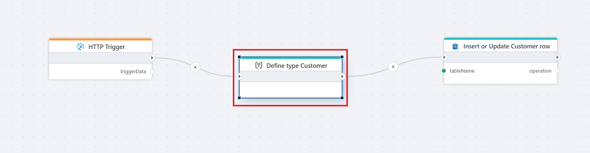
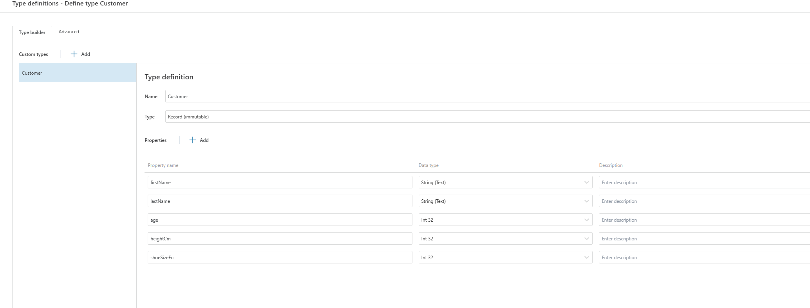

# Define type

This action is **OBSOLETE** - use [this](../../flows/defining-custom-types.md) instead.

-----

Defines one or more custom data types using a type builder interface, JSON schema or C#.

Use the type builder when the data type of all properties in the custom type is a [built-in .NET type](https://learn.microsoft.com/en-us/dotnet/csharp/language-reference/builtin-types/built-in-types).  

If you need to define complex, nested types, use the C# or JSON schema editor in the `Advanced` tab.




**Example**   
This Flow receives customer data through an HTTP endpoint and writes it to a database table.

The Flow starts with an [HTTP Trigger](../../triggers/http-trigger.md), which accepts an incoming request containing customer data. The incoming payload is then mapped to a strongly typed Customer record using the **Define type** Customer action. This step defines the expected structure of the data and ensures it is passed forward in a consistent format.

Finally, the Flow uses the [Insert or Update Customer row](../sql-server/insert-or-update-row.md) action to persist the customer data in a SQL table. Depending on the configuration of the action, an existing row is updated or a new row is inserted.

This Flow is typically used to expose a simple API endpoint for creating or updating customer records while keeping data structure and database logic centralized inside the Flow.

<br/> 

## Properties

| Name         | Data type       | Description                                       |
|--------------|-----------------|---------------------------------------------------|
| Title           | Optional | The title or name of the action.     |
| Type definition         | Required   | Definition of one or more custom data types using JSON schema or C#. |
| Description   | Optional      | Additional notes or comments about the action or configuration.   |

## Type definition



## Advanced type definition

```csharp
public record Customer
{
    public string FirstName { get; init; }
    public string LastName { get; init; }
    public int Age { get; init; }
    public int HeightCm { get; init; }
    public int ShoeSizeEu { get; init; }
}

```

- Each property must have a name that matches the property name used in the Flow.

- Properties define the shape of the data passed between actions.

- Record with *init* properties makes the type immutable, which matches how Flow data is typically handled.

- Property names are case-sensitive when mapping data.


**Use Advanced when:**

- You want full control over the type definition.

- You need to copy or version type definitions across Flows.

- You prefer writing types as code instead of clicking through the UI.

- You want to define the type quickly when there are many properties.

**Use Type Builder when:**

- You want a visual overview.

- The type is simple and unlikely to change.

- You want built-in validation through the UI.