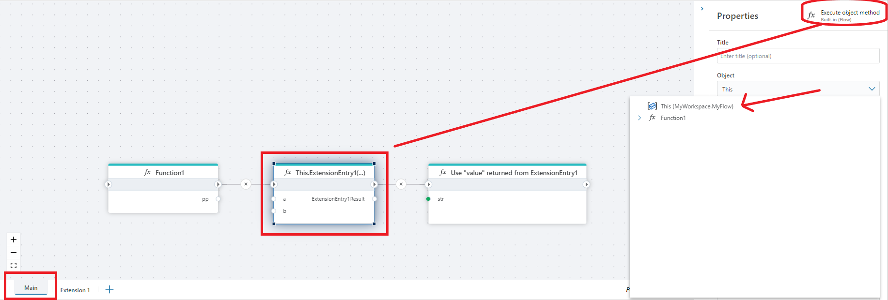

# Execute object method

Executes a method of an object.

This is equivalent to invoking an instance method of an object. If the method has parameters, you must specify an argument to each parameter.

[Related reading: Introduction to classes in .NET](https://learn.microsoft.com/en-us/dotnet/csharp/fundamentals/tutorials/classes)

**Example**   
This Flow demonstrates how to expose reusable logic through an Extension Entry and how to execute it from a main Flow while enforcing a strict result contract.

The Main flow starts by declaring a result variable and is triggered via a [Flow Hook](flow-hook.md). It then invokes the extension by using the **Execute object method**, calling the [ExtensionEntry](extension-entry.md) method on the current Flow object (This). The return value from the extension is stored in the result variable.

After the extension call completes, the Flow evaluates the returned status code using a condition (result == 1). If this condition is met, the Flow deliberately fails by throwing an exception using the Throw exception action. This allows the main Flow to explicitly handle error states reported by the extension.

The Extension flow defines its public API using the Extension Entry action. Inside the extension, the business logic is executed and its outcome is evaluated. When the operation completes successfully (result == 1), the extension explicitly sets the final return value using the Set result action, which is then propagated back to the calling Flow.

This pattern is useful when building reusable extensions that return standardized status codes, allowing calling Flows to centrally enforce success and error handling logic.
 

 

 

## Properties

| Name         | Data type       | Description                                       |
|--------------|-----------------|---------------------------------------------------|
| Title           | Optional | The title or name of the action.     |
| Object         | Required   | Select the object brom the dropdown list. |
| Method   | Required      | Select the method to execute.   |
| Method arguments  | Optional      | Add arguments.   |
| Description   | Optional | Additional notes or comments about the action or configuration. |