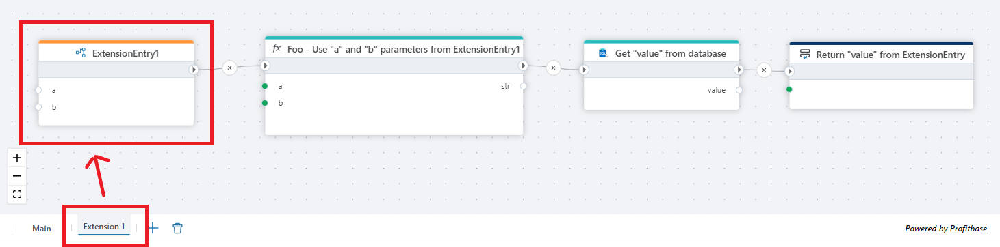

# Extension Entry

Defines the API of an Extension.

Use this action to define a block of reusable business logic that you want to execute from multiple places _within_ your Flow.  
The Extension Entry action can only be added to an `Extension flowchart`. It defines the entry point of the Extension, and must be the first action of the Extension flowchart.  

You can define any number of parameters, and optionally a return type.

To call the Extension Entry action from another flowchart, use the [Execute object](../built-in/execute-object-method.md) action and select the `This` globally available variable as the object. Then select the name of the Extension entry as the method, and specify arguments to the parameters (if any).

**Example**   
This Flow demonstrates how to expose reusable logic through an Extension Entry and how to execute it from a main Flow while enforcing a strict result contract.

The Main flow starts by declaring a result variable and is triggered via a [Flow Hook](flow-hook.md). It then invokes the extension by using the [Execute object method](execute-object-method.md), calling the **ExtensionEntry** method on the current Flow object (This). The return value from the extension is stored in the result variable.

After the extension call completes, the Flow evaluates the returned status code using a condition (result == 1). If this condition is met, the Flow deliberately fails by throwing an exception using the Throw exception action. This allows the main Flow to explicitly handle error states reported by the extension.

The Extension flow defines its public API using the Extension Entry action. Inside the extension, the business logic is executed and its outcome is evaluated. When the operation completes successfully (result == 1), the extension explicitly sets the final return value using the Set result action, which is then propagated back to the calling Flow.

This pattern is useful when building reusable extensions that return standardized status codes, allowing calling Flows to centrally enforce success and error handling logic.
 

 

 

## Properties

| Name               | Type     | Description |
|--------------------|----------|-------------|
|  Name           | Optional   | The name of the flowchart entry point. |
|  Is upgradable  | Optional  | Indicates whether this entry can be upgraded. |
|  Custom data types  | Required | Allows defining custom data types for the flowchart. |
|  Custom code    | Optional | Allows adding custom code to extend functionality. |
|  Description    | Optional | Provides additional information about this flowchart entry. |

