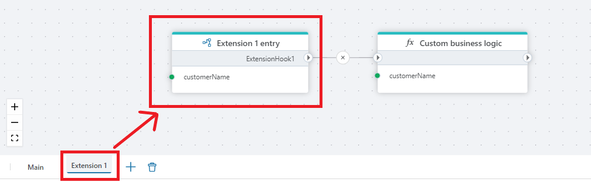

# Hook handler

Defines what should happen when a Flow Hook runs.

`Hooks handlers` are used to define the business logic of a [Hook](flow-hook.md). 
It enables product teams to create and distribute a Flow as part of a standard product, while allowing customers to extend its functionality without breaking the standard implementation. 

> [!NOTE]
> You can also use [Hooks](flow-hook.md) and Hook handlers to split a large Flow into smaller flowcharts.

To implement the business logic of a [Hook](flow-hook.md), use a Hook handler in an `Extension flowchart`, and define the business logic there.

In the example below, the actions are executed in the following order:  

Hooks and Hook handlers are simply control flow routing mechanisms, and does not do any actual work.

  

