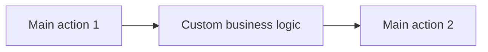
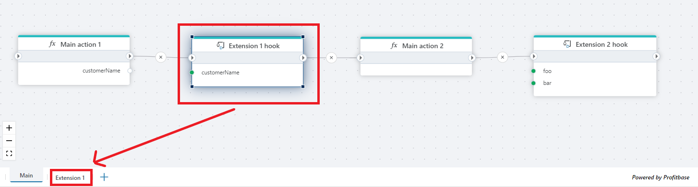
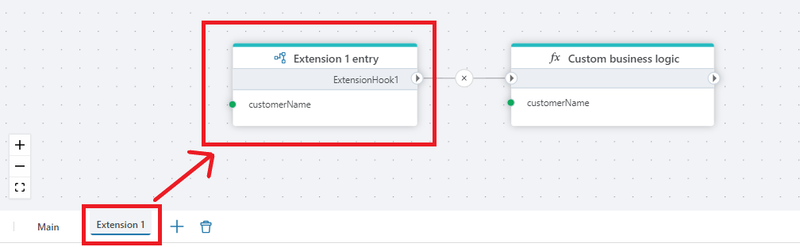

# Hook

Defines an interface for [extensions](extension-entry.md). 

`Hooks` are placeholders in a flowchart where custom logic can be plugged in without modifying the flowchart itself. Instead, users can create an `Extension flowchart` and define the custom business logic there.   
It enables product teams to create and distribute a Flow as part of a standard product, while allowing customers to extend its functionality without breaking the standard implementation. 

> [!NOTE]
> You can also use Hooks and [Hook handlers](flow-hook-handler.md) to split a large Flow into smaller flowcharts.

To implement the business logic of a Hook, use a [Hook handler](flow-hook-handler.md) in an `Extension flowchart`, and define the business logic there.

In the example below, the actions are executed in the following order:  

Hooks and Hook handlers are simply control flow routing mechanisms, and does not do any actual work.

  

## Properties

| Name         | Data type       | Description                                       |
|--------------|-----------------|---------------------------------------------------|
| Title           | Optional | The title or name of the action.     |
| Name         | Required   | The unique identifier of the Hook. |
| Parameters   |    Optional   | A list of inputs required for the Hook. |

