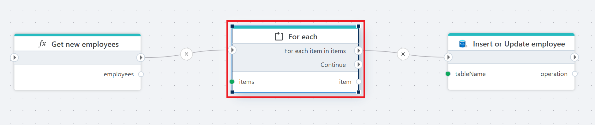

# For each (loop)

Iterates over a list of items.

 

**Example**   
This Flow [retrieves](function.md) a list of employees, iterates over each employee using the **For Each** action, and [inserts or updates](../sql-server/insert-or-update-row.md) their data in a database table.
 

## Properties

| Name            | Data Type | Description                                                   |
|-----------------|-----------|---------------------------------------------------------------|
| Title           | Optional  | The title or name of the action.                              |
| Items           | Required  | The collection of items to iterate over.                      |
| Loop Variable   | Optional  | The variable that holds the current item in each iteration.   |
| Description     | Optional  | Additional notes or comments about the action or configuration. |
