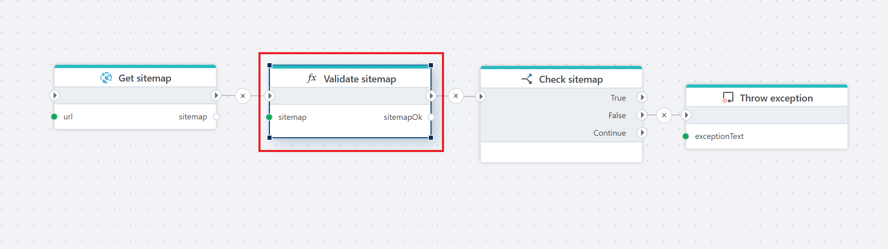
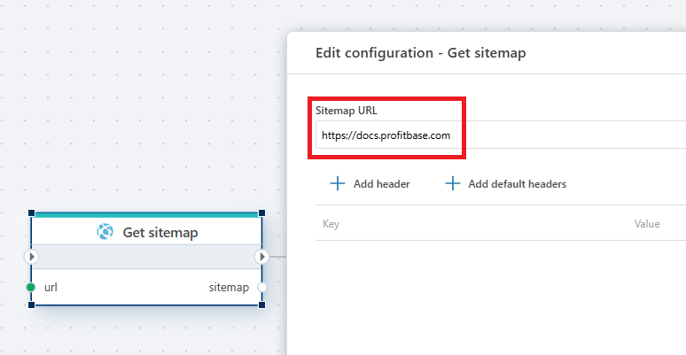
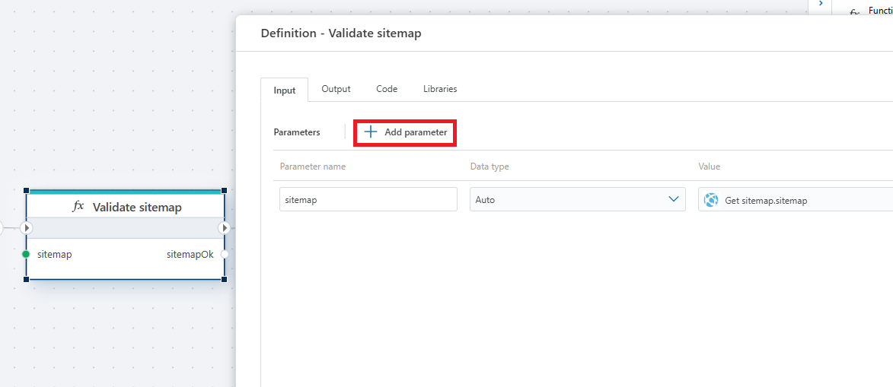
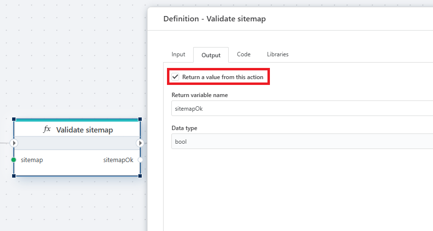
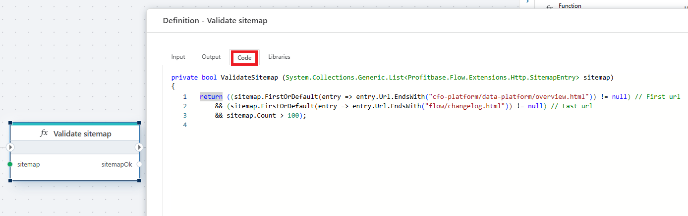
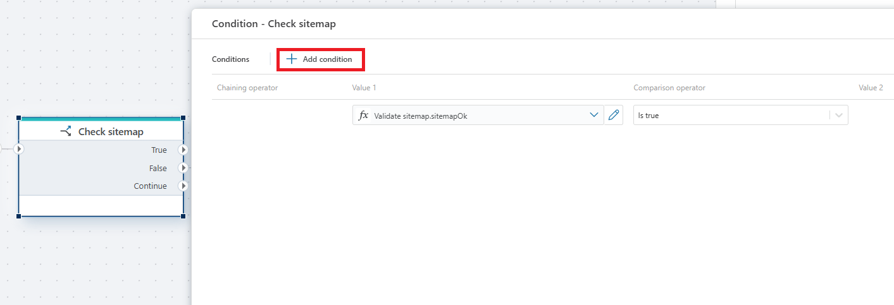
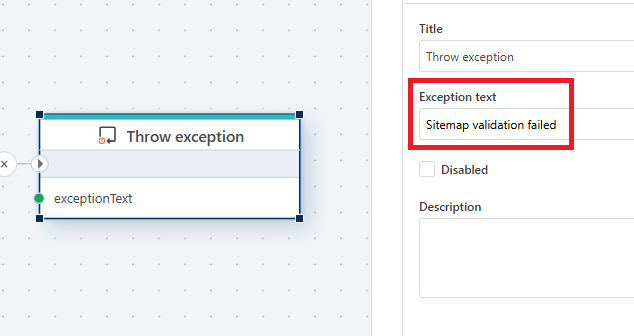

**Example**   
This flow retrieves a [sitemap](../../actions/http/get-sitemap.md) from a specified URL, [validates](if.md) its structure and content, and [throws an exception](throw-exception.md) if the validation fails.

 

## Detailed description:

This flow is designed to automatically verify the integrity and completeness of a website’s sitemap and alert the user if it doesn’t meet defined criteria.  
The flow consists of four main actions:

1. **Get sitemap** – Downloads the sitemap from the provided URL (in this case, https://docs.profitbase.com) and outputs it as the variable sitemap.

2. **Validate sitemap**  

 

The result of this validation is returned as a boolean variable sitemapOk.

 

A custom function that checks the sitemap’s content. It verifies that:
- It includes a URL ending with cfo-platform/data-platform/overview.html (the expected first URL),
- It includes a URL ending with flow/changelog.html (the expected last URL),
- The sitemap contains more than 100 entries.

 

3. **Check sitemap** – Evaluates whether sitemapOk is true. If so, the flow continues. If false, it triggers an exception.

4. **Throw exception** – If the sitemap validation fails, this action raises an error with the message “Sitemap validation failed.”

Go back to [Function](function.md), [Get Sitemap](../http/get-sitemap.md) or [If](if.md) documentation.
