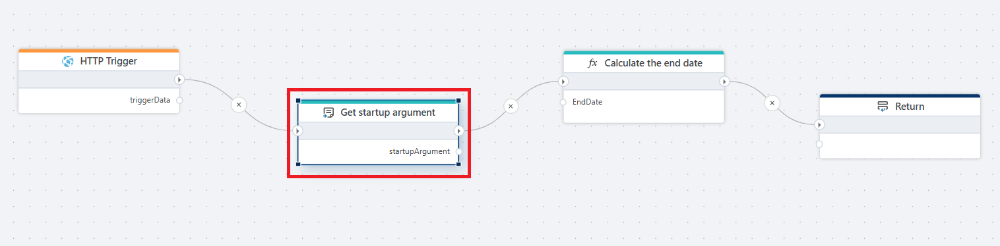
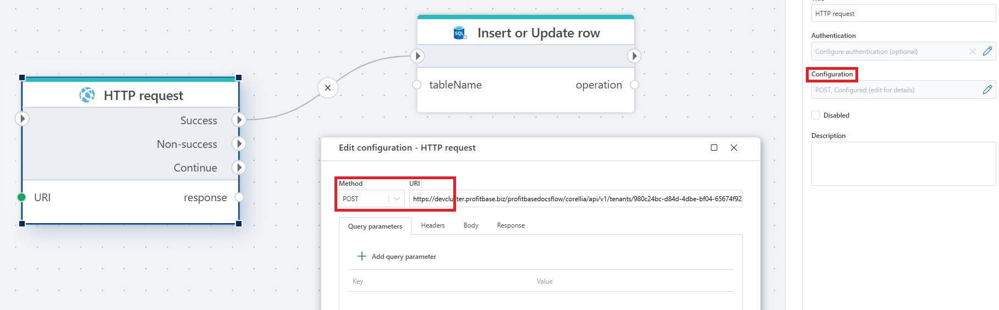

# Get Startup argument

Gets the data (if any) passed to the Flow from the caller.

Use **Get startup argument** when your flow is designed to be called by another flow (or an external caller) and you need to read the input payload that was sent with the call.

Typical use cases:
- A helper flow that calculates values and returns the result to the caller.
- A reusable flow that behaves differently based on the input passed at startup.
- Passing parameters between flows without storing state.

 

**Example**   
This flow is invoked via an [HTTP request](../http/http-request.md), reads the input payload using **Get startup argument**, [converts](convert.md) the received object to the required format, and [returns](return.md) the converted result back to the calling flow in the HTTP response.  The calling flow then inserts or updates the corresponding row in the database.

The calling flow uses an HTTP request action with the POST method to invoke another flow. The request URI points to the endpoint of the target flow. 

## How the call works

To call this flow from another flow:

1. Add an **HTTP request** action in the calling flow.
2. Set **Method** to `POST`.
3. Set **URI** to the endpoint URL of the target flow.
4. Pass the input data in the **Body** of the request.

When the target flow starts, **Get startup argument** exposes the request body as `startupArgument`.  
The flow uses this value to calculate the end date and the **Return** action sends the result back in the HTTP response.

>[!NOTE]
> This action can only be used in the Main flowchart.
