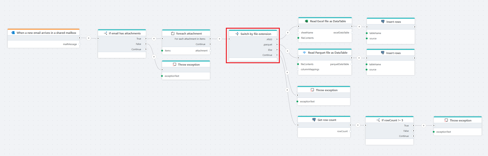

# If-Else

Defines an If-Else decision with **multiple** outcomes.

Use **If-Else** when your flow must choose **exactly one execution path** from multiple alternatives. The action evaluates the defined cases in order and executes the **first matching case**, ensuring clear and deterministic control flow.

In contrast, [If](if.md) is typically used for a **single condition** and does not inherently enforce mutually exclusive branches, which can make more complex decision logic harder to read and maintain.

**Example**   
This flow is triggered when a [new email arrives in a shared mailbox](../../triggers/microsoft-365-outlook/when-new-email-arrives-in-shared-mailbox-trigger.md). It first checks [if](if.md) the email contains attachments and [throws an exception](throw-exception.md) if none are found. [For each](foreach.md) attachment, the flow evaluates the file extension and processes supported formats accordingly: Excel files are [read into a DataTable](../excel/read-excel-file-as-datatable.md) and [inserted into a database table](../postgresql/insert-data.md), Parquet files are [read](../parquet/read-parquet-file-as-datatable.md) and inserted in the same way. If an unsupported file type is detected, an exception is thrown. After inserting the data, the flow validates the result by checking the number of inserted rows and throws an exception if the row count does not meet the expected value.

 

## Properties

| Property     | Data type | Description |
|--------------|-----------|-------------|
| Title    | Optional  | A descriptive name for the If-Else action. |
| Cases    | Required  | Defines one or more conditional cases that determine which branch of the flow is executed. |
| Disabled | Optional  | If enabled, the If-Else action will be skipped during flow execution. |
| Description | Optional | Optional free-text description explaining the purpose of this conditional logic. |

