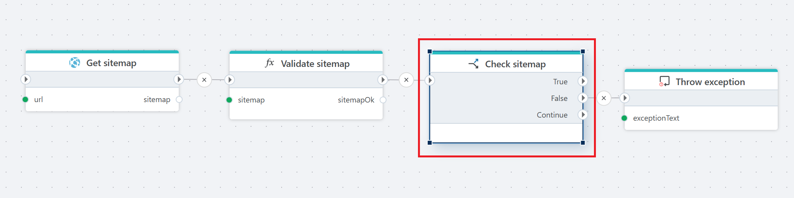

# If

Defines an If-Else decision with **two** possible outcomes.

Use **If** when you need to evaluate a **single condition** and execute an action **only when that condition is met**. It is ideal for simple, optional logic that should not affect the overall control flow when the condition is false.

In contrast, [If-Else](if-else.md) is designed for scenarios with multiple mutually exclusive outcomes and forces the flow to choose one execution path, which can be unnecessary for straightforward checks.

**Example**   
This flow retrieves a [sitemap](../../actions/http/get-sitemap.md) from a specified URL, [validates](function.md) its structure and content, and [throws an exception](throw-exception.md) if the validation fails. You will find a detailed description of this flow [here.](flow-getSitemap.md)

 

| Name         | Data type       | Description                                       |
|--------------|-----------------|---------------------------------------------------|
| Title           | Optional | The title or name of the action.     |
| Condition         | Required   | Executes an action only if the specified condition evaluates to true. |
| Description   |    Optional   | Aditional informations about the action. |

 

