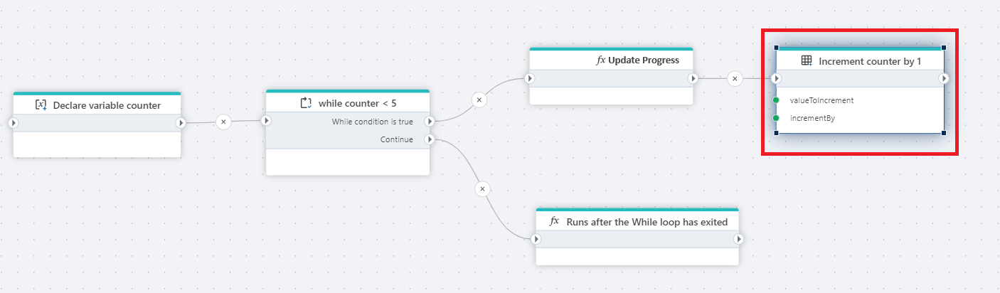
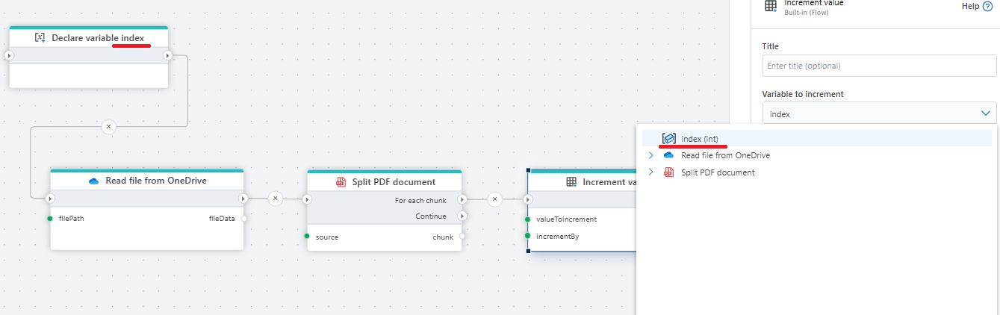
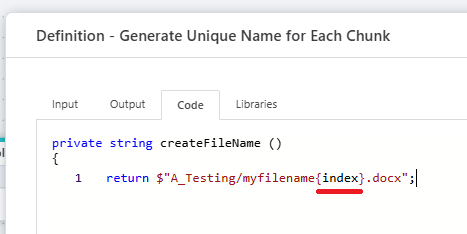

# Increment value

Increments a (numeric) value by a number.

A typical use case for this action is using it [While loops](while.md) to count the number of iterations and then exit when a threshold is reached.

**Example**   
This flow reads a PDF file from [OneDrive](../onedrive/read-file-from-onedrive-as-byte-array.md), splits it into smaller chunks, assigns a unique name to each chunk ([function](function.md)), converts each chunk to a Word format, and uploads the resulting Word documents back to [OneDrive](../onedrive/upload-file-to-onedrive.md).

The variable initialized at the beginning of the flow (called index) is used to track and generate unique names for each chunk of the PDF after it's split.

When the PDF is split into multiple chunks (pages or groups of pages), each chunk must be saved and uploaded with a unique filename to avoid overwriting previous files and to maintain proper organization.

 We generate the variable first to start a counter (from 0) that we can increment for naming each file chunk.
 

 

> [!NOTE]
> Without this step, all chunks would have the same name, and only one file would remain on OneDrive.

 

## Properties

| Name         | Data type       | Description                                       |
|--------------|-----------------|---------------------------------------------------|
| Title           | Optional | The title or name of the action.     |
| Variable to increment         | Required   | The name of variable to increment. |
| Increment by   | Required      | The number to increment by.   |
| Description   | Optional | Additional notes or comments about the action or configuration. |

 

## Returns
Returns a (numeric) value.