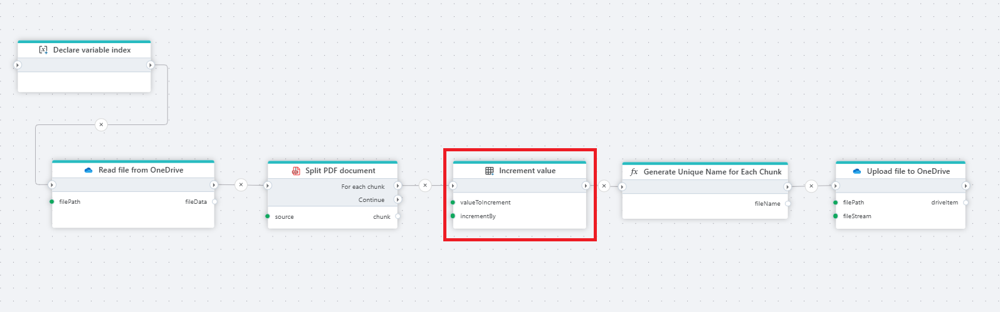

# Increment value

Increments a (numeric) value by a number.

A typical use case for this action is using it [While loops](while.md) to count the number of iterations and then exit when a threshold is reached.

 

## Returns
Returns a (numeric) value.

## Properties

| Name         | Data type       | Description                                       |
|--------------|-----------------|---------------------------------------------------|
| Title           | Optional | The title or name of the action.     |
| Variable to increment         | Required   | The name of variable to increment. |
| Increment by   | Required      | Write the value of incrementation.   |
| Description   | Optional | Additional notes or comments about the action or configuration. |
