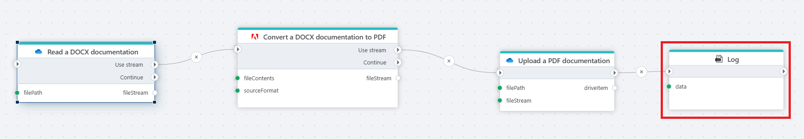
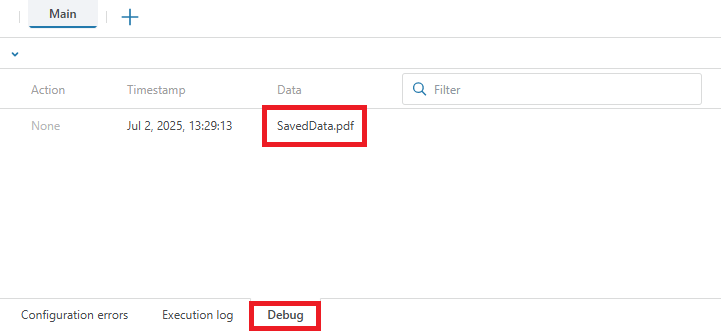

# Log

This is a utility action for writing messages to the log.

**Example**  
  
This flow automates the process of converting a DOCX document to a PDF, uploading the result, and logging the outcome.

 

## Properties

| Name          | Type     | Description                                                                 |
|---------------|----------|-----------------------------------------------------------------------------|
| Title         | Optional | The title or name of the action.                                           |
| Data to log   | Required | The actual data or expression to be recorded in the log.                   |
| Log type      | Optional | The severity level of the log message. Possible values:                    |
|               |          | – `Information`: General information messages.                             |
|               |          | – `Warning`: Alerts about potential issues.                                |
|               |          | – `Error`: Indicates that something went wrong.                            |
|               |          | – `Debug`: Used for development and debugging purposes.                    |
| Description   | Optional | Additional notes or comments about the action or configuration.            |

