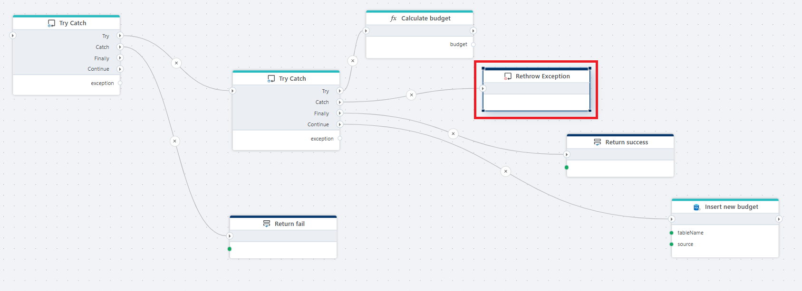

# Rethrow exception

Re-throws the exception that is currently being handled by a catch block.

**Example**   
This flow executes a budget [calculation](function.md) inside nested [Try/Catch](try-catch.md) blocks. If the calculation completes successfully, the result is returned and the new budget is inserted into the database. If an error occurs during the calculation, the exception is rethrown to stop execution and signal the failure to the calling flow. The flow is intentionally structured to ensure that database insertion only happens after a successful calculation and that errors are not handled silently or converted into partial results.

## Properties

| Name        | Type     | Description                                                                 |
|-------------|----------|-----------------------------------------------------------------------------|
| Title       | Optional | A custom name for the action, used to make the flow easier to read.        |
| Disabled    | Optional | When enabled, the action is skipped during flow execution.                |
| Description | Optional | Additional notes or comments about the action or configuration.         |
