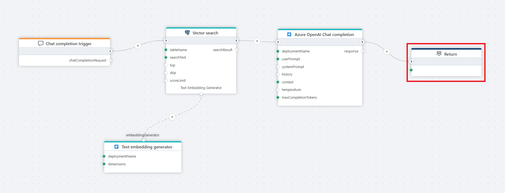
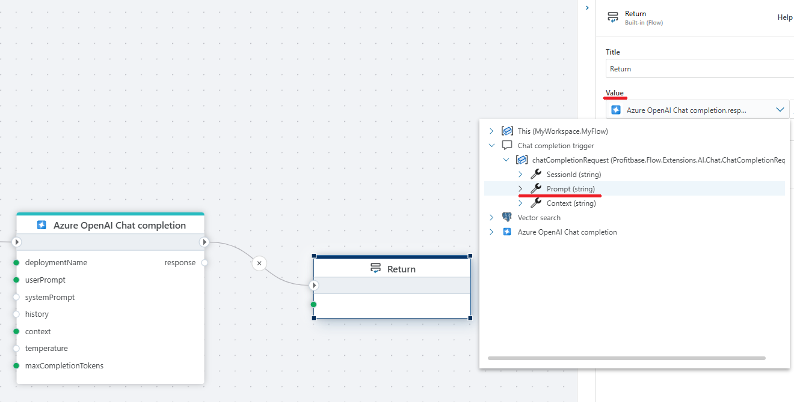

# Return

**Example**   
This flow processes a user's chat question by first receiving it through a [Chat completion](../../triggers/ai/chat-completion-trigger.md) trigger, then converting it into a vector using a [text embedder](../azure-ai/text-embedder.md), performing a [Vector search](../postgresql/vector-search.md) in a postgreSQL database for relevant context, and finally passing the user input and retrieved context to Azure OpenAI [Chat completion](../azure-ai/chat-completion.md), which generates a response that is returned to the client via the **Return** node.

 

When used in the `Main flowchart`, terminates the Flow and optionally returns data back to the caller.  
When used in an `Extension flowchart`, terminates the execution sub tree and optionally returns a value back to the caller.

