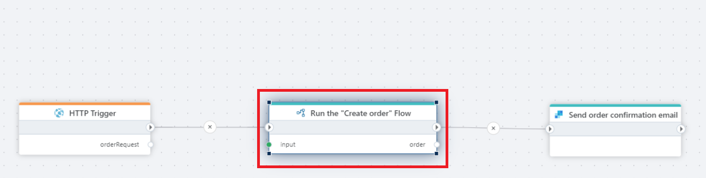

# Run Flow (nested execution)

Runs a Flow and awaits its completion before continuing.

Use this action if you want to run a Flow within another Flow. The main Flow will continue execution after the child Flow has completed. If a value is returned from the child Flow, it can be used in the main Flow.

If you need to start a Flow inside another Flow that ontinues without waiting for its completion, use [Start Flow](start-flow.md) action instead.

**Example**   
This flow uses Run Flow to trigger another Flow as a sub-process. The parent flow passes input parameters to the called flow, waits for it to complete, and then continues execution using the returned output. This allows complex logic to be split into smaller, reusable flows and helps keep the main flow easier to read, maintain, and reuse across multiple scenarios.
 

## Properties

| Name              | Type               | Description                                                    |
|-------------------|--------------------|----------------------------------------------------------------|
| Workspace         | Optional           | To run a Flow in a _different_ Workspace than the host Flow, specify the Workspace here. Note that if you point to a variable, the Flow selector will not display any options as the actual Workspace ID is only available at runtime. |
| Flow              | Required           | The Flow to run. |
| Input             | Optional           | The argument to pass to the Flow you want to run.              |
| Output data type  | Optional           | Specifies the data type of the value returned by the selected Flow.   You must specify the data type if you want to use the returned value as input data to other actions in the main Flow. If you don't, the main Flow will assume that the data type is [System.Object](https://learn.microsoft.com/en-us/dotnet/api/system.object), which will prevent you from using the returned value as input to most actions.   If the selected Flow returns a custom data type, you must toggle `Use custom type(s)` on, and specify the type definition(s) of the custom objects. The easiest way to get the custom type definitions is to open the selected Flow and copy the configuration of the custom types from there. |
| Output variable name | Required        | The name of the variable that contains the value returned value (if any) from the selected Flow. |

### Example

More on how to use the `Run Flow` action is demonstrated in the [nested execution topic](../../flows/running-flows/nested-execution.md).