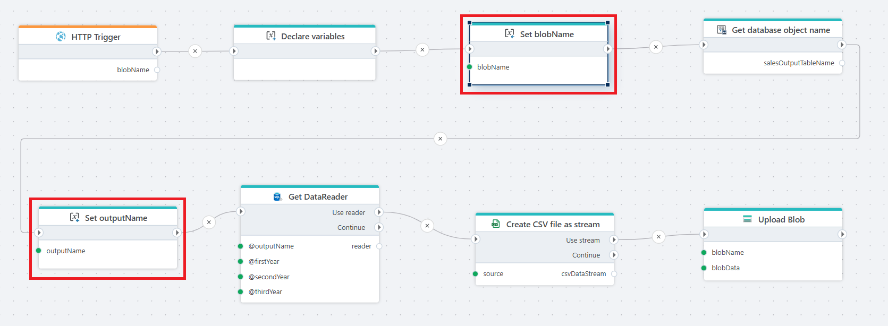

# Set variable

Assigns a value to an existing variable during flow execution.

The Set variable action is used to store or update values at runtime so they can be reused by later actions in the flow. This is commonly used to capture input parameters, store intermediate results, or pass resolved values between actions.

**Example**   
This flow is triggered via [HTTP trigger](../../triggers/http-trigger.md), [declares variables](declare-variables.md), [retrieves data](../sql-server/get-datareader.md) from the database, converts the result to a [CSV stream](../csv/create-csv-file-as-stream.md), and [uploads](../azure-blob-storage/upload-blob.md) the file to blob storage.  
The **Set variable** action is used to assign runtime values, such as the blob file name or resolved database object name, so they can be reused by subsequent actions in the flow.

 

## Properties

| Name           | Data Type | Description                                                                  |
|----------------|-----------|------------------------------------------------------------------------------|
| Title          | Optional  | The title or name of the action.                                             |
| Variable       | Required  | The variable that will receive the assigned value.                           |
| Variable value | Required  | The value to assign to the selected variable. This can be static or dynamic. |
| Disabled       | Optional  | If enabled, the action is skipped during flow execution.                     |
| Description    | Optional  | Additional notes.          |
