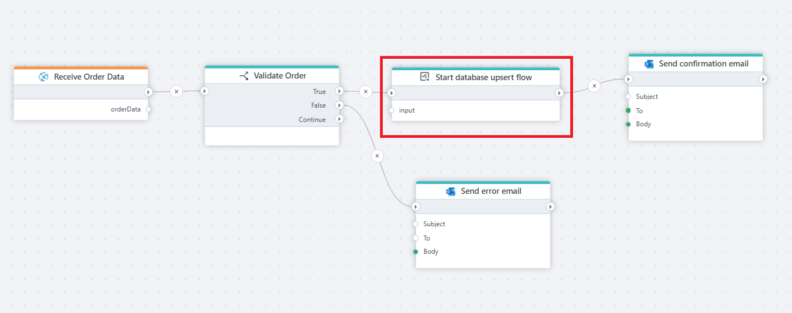

# Start Flow

Starts a Flow and continues without waiting for its completion.  

This action starts execution of a Flow and immediately continues the execution of the main Flow without waiting for the child Flow to complete. Execution of the child Flow is entirely disconnected from the main Flow, so any logs or output data from the child Flow cannot be read or associated with the main Flow.

If you need to run a Flow inside another Flow and wait for its completion, or get the value returned from it, use the [Run Flow](run-flow.md) action instead.

**Example** 

This flow receives order data, checks if it contains the necessary details, and then updates or inserts the order into the database. Once the order is saved, it sends a confirmation email to the user.

## Properties 

| Name        | Type      | Description |
|------------|----------|-------------|
| Title      | Optional | The title of the flow. |
| Flow       | Required | The name of the flow to start, choose existing flow from the dropdown list. |
| Input      | Optional | The input data passed to the flow. |
| Description | Optional | A description of the flow. |
