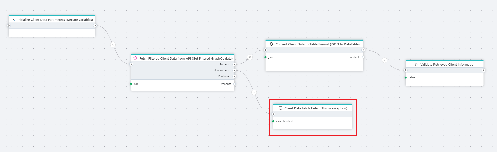

# Throw exception

Throws an exception with a user defined error message.

**Example**   
This flow retrieves filtered client data from a [GraphQL API](../graphql/graphql-request.md), converts it into a table format([Convert JSON to DataTable](../json/get-json-datareader.md)), and validates the results to ensure accurate client information was received. When the GraphQL request fails, **Throw Exception** node handles the error by displaying or logging an exception message.

## Properties 

| Name        | Type      | Description |
|------------|----------|-------------|
| Title      | Optional | The title of the action. |
| Exception text | Required | A user defined error message. |
| Description    | Optional | Additional notes or comments about the actions's purpose or configuration.  |

 
