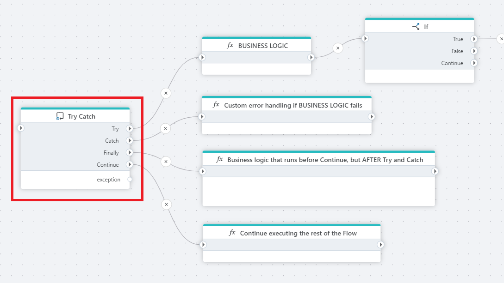

# Try-Catch

Handles [exceptions](https://learn.microsoft.com/en-us/dotnet/standard/exceptions/) within a section of the Flow.

Actions may crash due to errors that the system cannot recover from (for example network errors, out of memory or disk, invalid configurations, etc). When this happens, an exception is thrown and the Flow will terminate.

Use the Try-Catch action when you want to define how exceptions should be handled within a Flow.  
For example, you might want to send an email if a critical error occurs, and then either allow the Flow to continue, or [rethrow the exception](rethrow-exception.md) to terminate the Flow after the email has been sent.

A Try-Catch action creates a scope. You put the business logic that you want to perform in the Try block, and the error handling in the Catch block.

