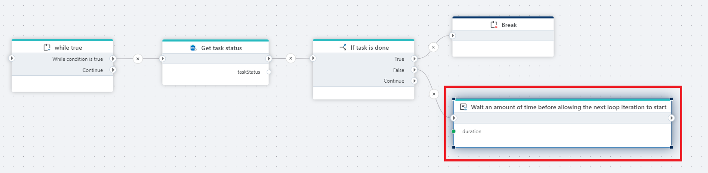

# Wait

Waits for a specified time interval before execution continues.

**Example**   
This flow uses the Wait action to pause execution for a defined period of time before continuing to the next step. It is typically used to handle timing dependencies, allow external systems to complete processing, or introduce controlled delays between actions to avoid race conditions or throttling issues.

 

## Properties

| Property        | Data type | Description |
|-----------------|-----------|-------------|
| Title       | Optional  | A descriptive name for the action. |
| Wait duration | Required  | The amount of time the flow execution will pause before continuing. The value can be specified in milliseconds, seconds, or minutes. |
| Disabled    | Optional  | If enabled, the action will be skipped during flow execution. |
| Description | Optional  | Optional free-text description explaining why a delay is required in the flow. |
