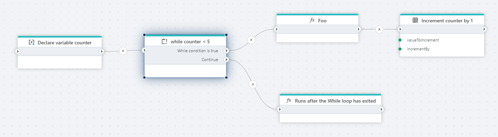
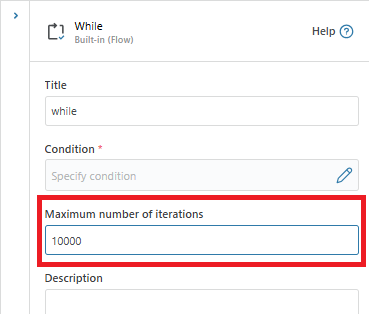

# While (loop)

Runs a loop while its condition evaluates to `true`.

When the condition no longer evaluates to `true`, execution continues from the `Continue` port.

| Name                            | Data Type   | Description                                           |
|---------------------------------|-------------|-------------------------------------------------------|
| Title                 | Optional    | Name of the loop.                       |
| Condition                  | Required    | Specify condition.         |
| Maximum number of iterations                  | Optional    | Sets a limit on the number of iterations the loop can perform before termination. |
| Description              | Optional    | Additional notes or comments about the action or configuration.    |

## Maximum number of iterations

This property prevents the loop from running indefinitely, which can cause performance issues. If set to 0 or left blank, the loop will have no limit and may run forever. Setting a reasonable maximum is recommended to avoid potential infinite loops.

