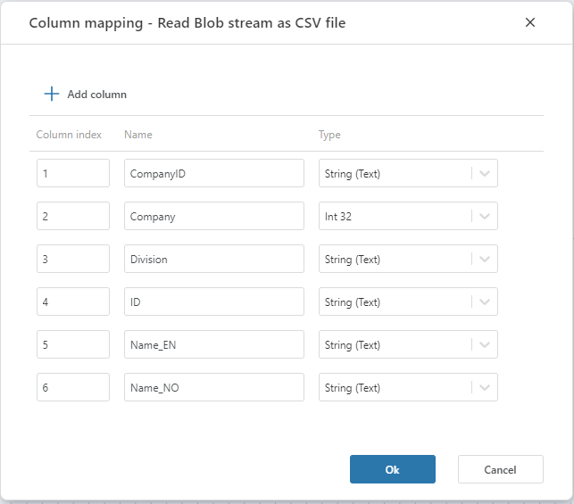
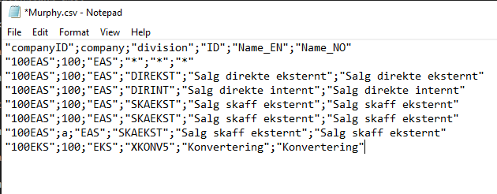

# Column mapping

The column mapping specifies the column names and data types in the resulting data set, and their relationships to the columns in the CSV file.

### Properties

| Name              | Description                                                                                |
|-------------------|--------------------------------------------------------------------------------------------|
| Field  index      | The index of the field in the CSV file. The index is 1-based.                              |
| Name              | The name of the column in the resulting data set that the field index should be mapped to. |
| Type              | The data type of the column in the resulting data set.                                     |

**Example**  

The following example shows the mapping between the fields in a CSV file and the columns in the resulting data set.

