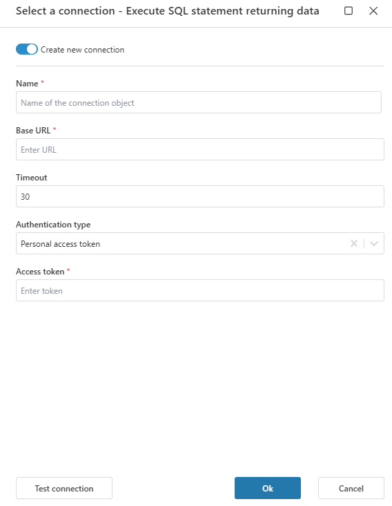

# Databricks Connection

When adding a [Databricks](https://www.databricks.com/databricks-documentation) action (e.g., *Execute SQL statement returning data*), you must define a connection to your Databricks workspace.

Profitbase Flow uses a **Base URL** and a **Personal Access Token** to authenticate and execute queries securely.

>  

 

## Connection details

A Databricks connection includes the following fields:

| Field | Description |
|-------|-------------|
| Name | A custom label for this connection. This name will appear when selecting the connection in a Flow action. |
| Base URL | The full URL of your Databricks workspace (e.g., `https://adb-1234567890123456.7.azuredatabricks.net`). |
| Timeout | Optional. The timeout in seconds for API requests (default: `30`). |
| Authentication type | Choose **Personal access token**. |
| Access token | A [Databricks personal access token](https://docs.databricks.com/en/dev-tools/auth/pat.html) generated in your user settings. Required to authenticate and execute actions. |

**Access Token Scope**: The token must have sufficient privileges to execute SQL statements in your workspace. Typically, it requires access to the SQL Warehouse or assigned compute resource.

 

## Generate a Personal Access Token

1. Go to your Databricks workspace.
2. In the top-right corner, click your **user icon** and choose **User Settings**.
3. Navigate to the **Access tokens** tab.
4. Click **Generate new token**.
5. Optionally, set a comment and expiry time.
6. Copy the generated token and paste it into the **Access token** field in Profitbase Flow.

> **Note**: You will not be able to view the token again after closing the dialog. Store it securely.

 

**Example**

| Field | Example |
|-------|---------|
| Base URL | `https://adb-1234567890123456.7.azuredatabricks.net` |
| Access token | `dapiexampletokenabcdef1234567890` |

 

 

## Best Practices

- Use **least privilege** when generating tokens.
- Consider creating dedicated service users or automation tokens for Flow.
- Regularly **rotate tokens** and remove unused ones.

---

Would you like to test the connection? Use the **Test connection** button to ensure your Base URL and token are valid before proceeding.
