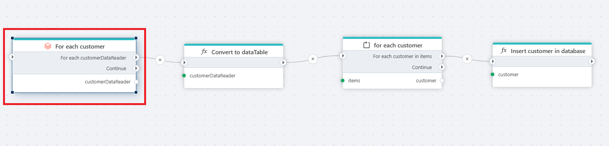

# Execute SQL statement returning data

[Executes a SQL statement](https://docs.databricks.com/api/azure/workspace/statementexecution/executestatement) in [Databricks](https://www.databricks.com/databricks-documentation) and iterates over each chunk of data returned.

**Example**   
This flow reads customer data, transforms it, iterates over it, and inserts it into a database. 

## Returns

This action iterates over all chunks of data returned for the query. You will get a [IDataReader](https://learn.microsoft.com/en-us/dotnet/api/system.data.idatareader) for each chunk.

## Properties

| Name              | Type       | Description												|
|-------------------|------------|----------------------------------------------------------|
| Connection        | Required   | Name of the Databricks connection.						|
| Warehouse Id      | Required   | Id of the Databricks SQL Warehouse.						|
| Catalog           | Optional   | Name of the Databricks [catalog](https://learn.microsoft.com/en-us/azure/databricks/introduction/).  |
| Schema            | Optional   | Name of the Databricks schema.							|
| SQL expression and parameters   | Required   | Definition of the Databricks SQL command.				|
| Chunk variable name | Optional   | Name of the variable containing the DataReader result.				|

## Limitations

The maximum memory size of a chunk is 25 MB.
