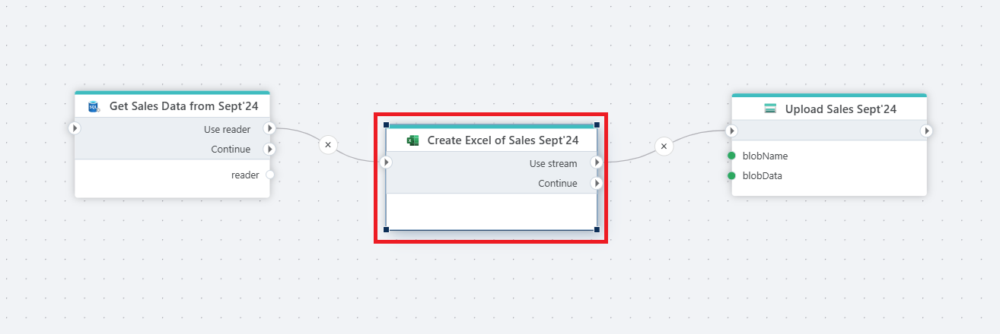

# Create Excel file as stream

Creates an Excel file from a [DataTable](https://learn.microsoft.com/en-us/dotnet/api/system.data.datatable) or [DataReader](https://learn.microsoft.com/en-us/dotnet/api/system.data.idatareader) and returns the result as a [Stream](https://learn.microsoft.com/en-us/dotnet/api/system.io.stream).

**Example**   
This Flow [exports sales data](../sql-server/get-entities.md) for September 2024 and uploads it as an Excel file. It begins by retrieving the sales records using a database reader, then passes the resulting data into the Create Excel action, which generates an Excel file as a stream. The stream is then sent to the [Upload Sales](../azure-blob-storage/upload-blob.md) Sept’24 action, where it is saved to storage under the specified blob name. This pattern is useful for automating scheduled reports, monthly data exports, and delivering Excel files to downstream systems or users.

 

## Properties

| Name                 | Type     | Description                                                                                                   |
| -------------------- | -------- | ------------------------------------------------------------------------------------------------------------- |
| Title                | Optional |   The title of the action.                    |
| Source               | Required | Specifies the source of the data, which can either be a DataTable or DataReader.                              |
| Sheet name           | Optional | Specifies a worksheet name. |
| Column mapping       | Optional | Defines the mapping between Excel column letters and business object property names.                          |
| Worksheet formatting options | Optional | Specifies detailed formatting options.                                                                                                      |
| Byte array variable name | Optional | The name of the variable you can use to reference the Stream in other actions.                |
| Description | Optional |  Additional notes or comments about the action or configuration. |

 

## Returns

Returns the Excel file as a [Stream](https://learn.microsoft.com/en-us/dotnet/api/system.io.stream)

 

### Automatic column mapping

Columns can be mapped automatically by using the "Map from sample file" option.

 

[!INCLUDE ]
