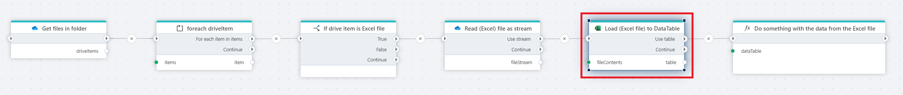

# Load Excel sheet to DataTable

Loads the contents of an Excel sheet into memory as a [DataTable](https://learn.microsoft.com/en-us/dotnet/api/system.data.datatable).

## Properties

| Name                | Type     | Description                                                                                                                                             |
| ------------------- | -------- | ------------------------------------------------------------------------------------------------------------------------------------------------------- |
| File contents       | Required | Select the file contents (Stream or byte array).                                                                                                        |
| Sheet name          | Optional | The name of the worksheet to read data from. If you don't specify anything, data is read from the first worksheet in the file.                          |
| Data start row      | Optional | The row number of the first row to read. If the worksheet has a header row, `Data start row` is typically `2`.                                          |
| Column mapping      | Required | Defines the mapping between the `column letters` (A,B,C, etc) in a worksheet, and the `column names` (CustomerID, Amount, etc) in the target DataTable. |
| Table variable name | Optional | The name of the DataTable variable returned from the action.                                                                                            |

 

### Automatic column mapping

Columns can be mapped automatically by using the "Map from sample file" option.

## Returns

[DataTable](https://learn.microsoft.com/en-us/dotnet/api/system.data.datatable) containing data from all rows and columns as specified by the `Data start row` and `Column mapping` properties.
