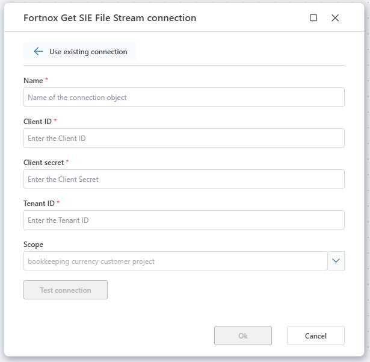

# Fortnox connection

To use Fortnox actions in **Profitbase Flow**, you must either select an **existing connection** or create a new one.

 

The connection authorizes Flow to interact with the Fortnox REST API on your behalf. It requires authentication credentials issued for your registered client application.

 

## Connection properties

A [Fortnox connection](https://www.fortnox.se/developer/authorization/get-access-token-using-client-credentials) consists of the following fields:

| Name             | Description |
|------------------|-------------|
| Connection Name  | A user-defined name for this connection. |
| Client ID        | A unique identifier for your application registered with Fortnox. |
| Client Secret    | A confidential string used for authenticating your client app. |
| Tenant ID        | The identifier of the Tenant (database id).  |
| Scope            | Select one or more [scopes](https://www.fortnox.se/developer/guides-and-good-to-know/scopes) for use in requests. |

 

 

> [!NOTE]
> A [Dynamic Connection](./create-connection.md) can be used to override this default connection during flow execution.  
> This is useful when connecting to different subscriptions programmatically or pulling credentials from external sources at runtime.

 

## Related documentation

- [Fortnox API authentication](https://www.fortnox.se/developer/authorization/get-access-token-using-client-credentials)
- [Fortnox Scopes](https://www.fortnox.se/developer/guides-and-good-to-know/scopes)
- [Create dynamic Fortnox connection](./create-connection.md)