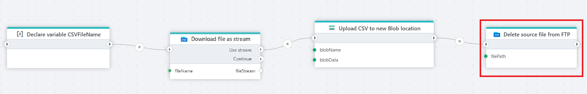

# Delete file

Deletes a selected file in an FTP / SFTP directory.

**Example**   
This flow retrieves a CSV file from [Azure Blob Storage](../azure-blob-storage/read-blob-as-byte-array.md), uploads it to a new location for further processing or archiving, and deletes the original file from the FTP server to maintain a clean file system and prevent duplicate ingestion.

 

## Properties

| Name             | Type      |Description                                             |
|------------------|-----------|--------------------------------------------------------|
| Title  | Optional |   The title of the action.       |
| Connection | Required  | Select a connection to the FTP or SFTP server where the file is located. |
| File path | Required | Select or enter the full path (including filename) of the file to delete. |
| Description | Optional | Additional notes or comments about the action or configuration. |