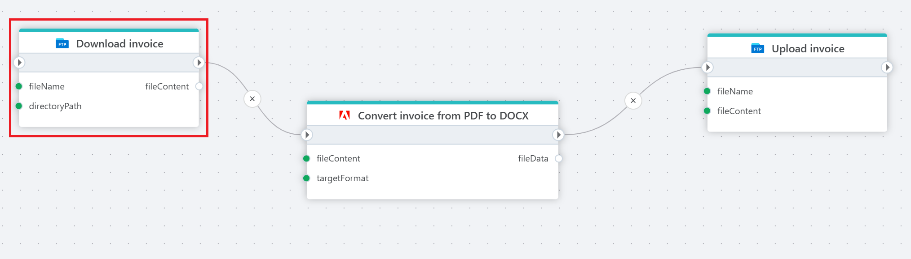

# Download file as byte array

Downloads a file from an FTP / SFTP directory into memory as a byte array.

**Example**   
This flow **downloads** an invoice as a PDF file from an FTP server, [converts](../adobe/pdf-to-non-pdf-as-byte-array.md) it to a editable Word document (.docx), and [uploads](upload-file.md) the converted file back to the server in a different folder for further editing or approval.

 

## Returns

Returns chosen file as a [byte](https://learn.microsoft.com/en-us/dotnet/api/system.byte) [array](https://learn.microsoft.com/en-us/dotnet/csharp/language-reference/builtin-types/arrays).

 

## Properties

| Name             | Type      |Description                                             |
|------------------|-----------|--------------------------------------------------------|
| Title  | Optional |   The title of the action.       |
| Connection | Required  | Select a connection to the FTP or SFTP server where the file is located. |
| File name | Required | Select or enter the name of the file to download. |
| Directory path | Optional | Select or enter the directory to download from. |
| Return variable name | Required | Name of the variable containing the downloaded file. |
| Description   | Optional | Additional notes or comments about the action or configuration. |
