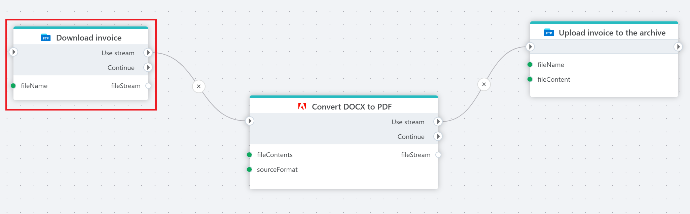

# Download file as stream

Downloads a file from an FTP / SFTP directory into a [Stream](https://learn.microsoft.com/en-us/dotnet/api/system.io.stream).

**Example**   
This flow **downloads** an invoice as a DOCX file from an FTP server. For archiving purposes, the file is [converted](../adobe/non-pdf-to-pdf-as-stream.md) to a read-only PDF format, [uploaded](upload-file.md) and stored in a separate folder.

 

## Properties

| Name             | Type      |Description                                             |
|------------------|-----------|--------------------------------------------------------|
| Title  | Optional |   The title of the action.       |
| Connection | Required  | Select a connection to the FTP or SFTP server where the file is located. |
| File name | Required | Select or enter the name of the file to download. |
| Directory path | Optional | Select or enter the directory to download from. |
| File stream name | Optional | Name of the file stream. |
| Description   | Optional | Additional notes or comments about the action or configuration. |

 

## Returns

Returns chosen file as a [Stream](https://learn.microsoft.com/en-us/dotnet/api/system.io.stream).
