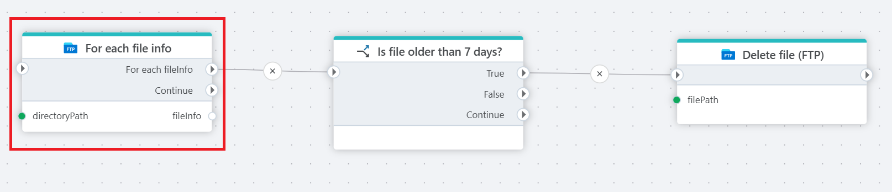

# For each file info

Iterates over a list of information per file in an FTP / SFTP directory.

**Example**   
This flow uses **For each file info** to iterate through all files in a specific FTP folder. It evaluates [if](../built-in/if.md) each file is older than 7 days and [deletes](delete-file.md) it from the server if the condition is met, helping to maintain available storage.

 

## Returns

A **FileInfo** object which contains the following properties:

- **FileName** – The name of the file.
- **FilePath** – The full path to the file on the FTP server.
- **IsFolder** – Indicates whether the item is a folder (`true`) or a file (`false`).
- **LastModified** – The date and time the file was last modified.
- **Size** – The size of the file in bytes.

## Properties

| Name             | Type      |Description                                             |
|------------------|-----------|--------------------------------------------------------|
| Title  | Optional |   The title of the action.       |
| Connection | Required  | Select a connection to the FTP or SFTP server where files are located. |
| File name | Optional | Select or enter the name of the file. |
| Directory path | Optional | Select or enter the directory to download from. |
| Include files in sub directories | Optional |  |
| Description   | Optional | Additional notes or comments about the action or configuration. |