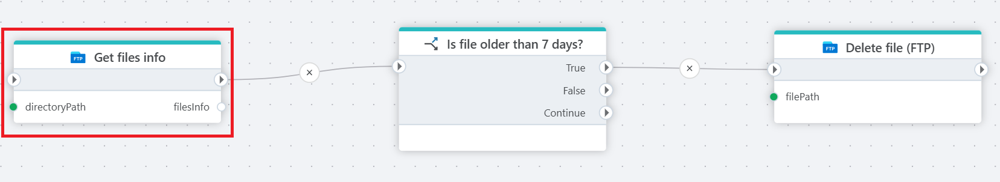

# Get files info

Gets a list of information per file in an FTP/SFTP directory.

**Example**   
This flow uses **Get files info** to retrieve a list of information per file in an FTP/SFTP directory. It then loops through each file entry to check [if](../built-in/if.md) it is older than 7 days, and [deletes](delete-file.md) it from the server if the condition is met. This helps maintain available storage and ensures outdated files are regularly removed.

 

## Returns

A **FileInfo** objects which contain the following properties:

- **FileName** – The name of the file.
- **FilePath** – The full path to the file on the FTP server.
- **IsFolder** – Indicates whether the item is a folder (`true`) or a file (`false`).
- **LastModified** – The date and time the file was last modified.
- **Size** – The size of the file in bytes.

## Properties

| Name             | Type      |Description                                             |
|------------------|-----------|--------------------------------------------------------|
| Title  | Optional |   The title of the action.       |
| Connection | Required  | Select a connection to the FTP or SFTP server where files are located.|
| Directory path | Optional | Select or enter the directory to download from. |
| Return variable name | Optional | Name of the variable. |
| Description   | Optional | Additional notes or comments about the action or configuration. |
