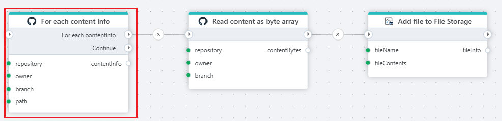

# For each Content Information

Iterates over a list of content information from a GitHub repository. Each content item contains a name, type, and URL to a file or directory.

**Example**   
This flow iterates through content, reads the file, and uploads the file to an Profitbase Invision File Storage.

## Properties

| Name             | Type      |Description                                             |
|------------------|-----------|--------------------------------------------------------|
| Title  | Optional | The title of the action.   |
| Authentication |  Optional | Select an authentication token. |
| Repository owner | Required | Select or enter the repository owner. |
| Repository name | Required | Select or enter the repository name. |
| Branch | Optional | Select or enter a branch name. |
| Path | Optional | Path to list content from. |
| Content Filter | Optional | Filter expression to reduce files by a name or extension pattern. See below. |
| Include content in subdirectories | - | Check to Include content in subdirectories. |
| Include directories | - | Check to include directories in the result. |
| Return variable name | Optional | Name of the variable containing the current Content Information object. |
| Description | Optional | Additional notes or comments about the action or configuration. |

### Limitations

GitHub [limits](https://docs.github.com/en/rest/using-the-rest-api/rate-limits-for-the-rest-api?apiVersion=2022-11-28) the number of REST API requests that you can make within a specific amount of time.

You can make unauthenticated requests if you are only fetching public data. Unauthenticated requests are associated with the originating IP address, not with the user or application that made the request.
The primary rate limit for unauthenticated requests is 60 requests per hour.

For authenticated users the rate limit is 5,000 requests per hour. If the installation is on a GitHub Enterprise Cloud organization, it has a rate limit of 15,000 requests per hour.

### Authentication

Authentication is done with an authentication token. Click [here](https://docs.catalyst.zoho.com/en/tutorials/githubbot/java/generate-personal-access-token/) for more on creating a token.

### Filter

Filters are based on [Regular Expressions](https://learn.microsoft.com/en-us/dotnet/standard/base-types/regular-expression-language-quick-reference) (Reg.Ex).

To e.g. getting files ending with extension .md (markdown), the expression will be: '/\.md$/'
