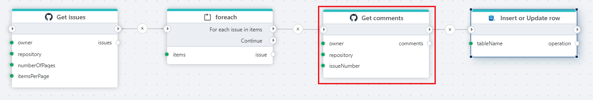

# Get issue comments

Gets a list of comments on a GitHub issue.

**Example**   
This flow gets a list of issues from in GitHub repository. For each issue, comments are read and stored in an SQL server table.

## Properties

| Name             | Type      |Description                                             |
|------------------|-----------|--------------------------------------------------------|
| Title  | Optional | The title of the action.   |
| Authentication |  Optional | Select an authentication token. See below. |
| Repository owner | Required | Select or enter the repository owner. |
| Repository name | Required | Select or enter the repository name. |
| Number of pages to fetch | Optional | Limit the number of pages to fetch. |
| Issues number | Optional | Select or enter the issue number. |
| Comments per page | Optional | Number of comments per page. |
| Comments since | Optional | Enter the start date to fetch comments from.  |
| Additional options | Optional | The configuration dialog contains settings for Sort options and Text format for the result (Text / HTML / Raw). |
| Result variable name | Optional | Name of the variable containing the comment list. |
| Description | Optional | Additional notes or comments about the action or configuration. |

### Limitations

GitHub [limits](https://docs.github.com/en/rest/using-the-rest-api/rate-limits-for-the-rest-api?apiVersion=2022-11-28) the number of REST API requests that you can make within a specific amount of time.

You can make unauthenticated requests if you are only fetching public data. Unauthenticated requests are associated with the originating IP address, not with the user or application that made the request.
The primary rate limit for unauthenticated requests is 60 requests per hour.

For authenticated users the rate limit is 5,000 requests per hour. If the installation is on a GitHub Enterprise Cloud organization, the installation has a rate limit of 15,000 requests per hour.

### Authentication

Authentication is done with an authentication token. Click [here](https://docs.catalyst.zoho.com/en/tutorials/githubbot/java/generate-personal-access-token/) for more on creating a token.

 

[!INCLUDE ]
