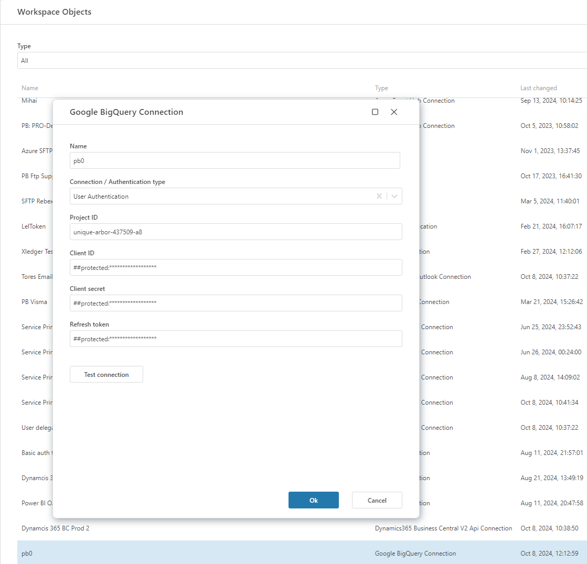
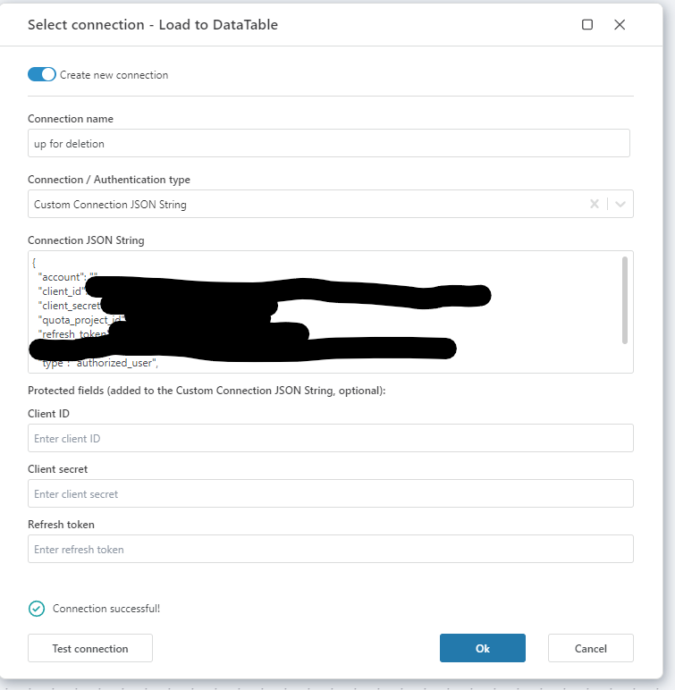

# Connecting to BigQuery

[Ref. Logging in to BigQuery documentation.](https://cloud.google.com/bigquery/docs/connections-api-intro)

When adding a BigQuery action, select an [existing connection](../../workspaces/workspace-objects.md) or create a new one. 

## Connection details

A BigQuery connection consists of the following fields:

| Field                         |                  | Description                                                                                      |
|-------------------------------|------------------|--------------------------------------------------------------------------------------------------|
| Name                          |       Required     | Name of the connection.                                                                |
| Connection/Authentication Type |                | Choose between a custom connection string (see below) or the BigQuery default connection type.      |
| Project ID                    |   Required      | ID of the Google Cloud project associated with the BigQuery dataset. Required.                  |
| Client ID                     | Required        | ID of the application used to generate the refresh token.                                           |
| Client secret                 | Required        | Secret of the application used to generate the refresh token.          |
| Refresh token                 | Required        | The refresh token obtained from Google used to authorize access to BigQuery.  |

[For a detailed documentation, click here](https://learn.microsoft.com/en-us/azure/data-factory/connector-google-bigquery?tabs=data-factory#using-user-authentication).

## Sample connection 

### User authentication:

### Custom connection JSON string:

