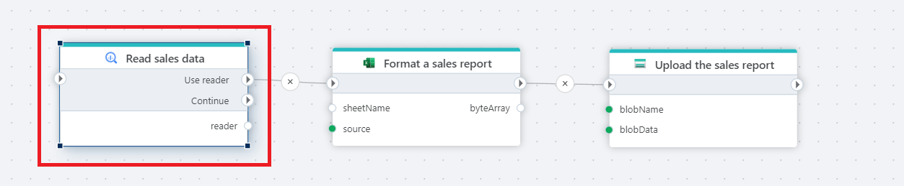

# Get DataReader

Provides a [DataReader](https://learn.microsoft.com/en-us/dotnet/api/system.data.sqlclient.sqldatareader) for reading a forward-only stream of rows from a Google BigQuery database.

**Example**   
This flow reads data from a Google BigQuery database using a forward-only data reader and processes the result as a stream.  
It executes a SQL query, exposes the result as a **DataReader**, and passes that reader to downstream actions that consume the data sequentially, such as formatting the result and uploading it as a file.

 

## Properties

| Name | Data type | Description |
|------|----------|-------------|
| Title | Optional | The name of the action as shown in the flow. |
| Connection | Required | The Google BigQuery [connection](connecting-to-bigquery.md) used to execute the query. |
| SQL expression and parameters | Required | The SQL query to execute, including any parameters. |
| Reader variable name | Optional | Name of the variable that stores the returned DataReader for use by subsequent actions. |
| Description | Optional | Additional notes about the action or its configuration. |

 

## Returns

[IDataReader](https://learn.microsoft.com/en-us/dotnet/api/system.data.idatareader)

