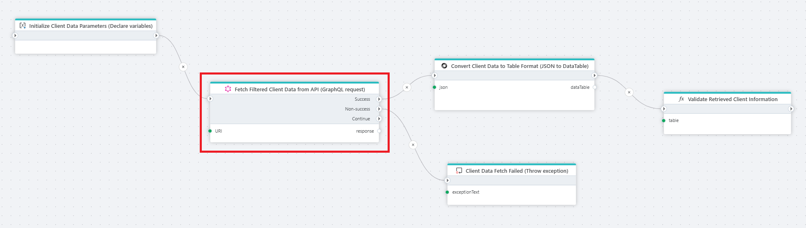
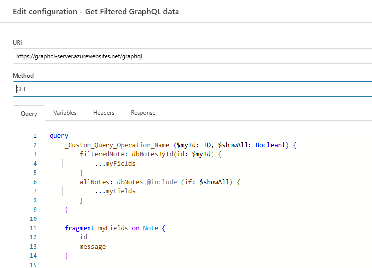

# GraphQL request

Executes a GraphQL query or mutation against a [GraphQL](https://graphql.org/learn/)-compatible API. It supports both GET and POST methods, along with GraphQL capabilities - *filters*, *arguments*, *fragments*, *aliases*, and *operation names*.

**Example**   
This flow retrieves filtered client data from a [GraphQL API](../graphql/graphql-request.md), converts it into a table format([Convert JSON to DataTable](../json/get-json-datareader.md)), and validates the results to ensure accurate client information was received. When the GraphQL request fails, [Throw Exception](../built-in/throw-exception.md) node handles the error by displaying or logging an exception message.

## Properties

| Name          | Type     | Description                                                                 |
|---------------|----------|-----------------------------------------------------------------------------|
| Title         | Optional | The title or name of the action.                                            |
| Configuration | Required | Opens the configuration editor for the GraphQL request.                    |
| Description   | Optional | A field to describe the action or its purpose.                             |

## Returns

Returns the requested data converted to the object type defined in the Response tab of the **Configuration** property. 

## Configuration

| Name          | Type     | Description                                                                 |
|---------------|----------|--------------------------------------------------|
| URI           | Required | The endpoint URL of the GraphQL API to which the request will be sent.     |
| Method        | Required | The HTTP method for the request         |
| Query         | Required | The GraphQL query (or mutation) to execute.                                   |
| Variables     | Optional | The list of variables used in the GraphQL query.                   |
| Headers       | Optional | The list of custom HTTP headers used in the GraphQL query.              |
| Response      | Optional | The object type of the query (or mutation) response data. |

