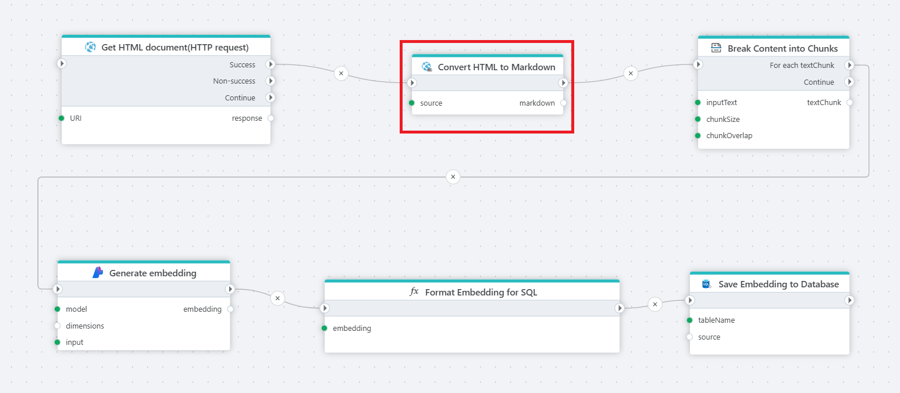

# Convert HTML to Markdown

Returns [Markdown](https://en.wikipedia.org/wiki/Markdown) text from a HTML document (page).

**Example**   
This Flow reads a [website sitemap](get-sitemap.md), downloads the [HTML](http-request.md) of each page, converts HTML to Markdown, [splits the cleaned content](../ai/split-text.md), [generates embeddings](../azure-ai/generate-embedding.md) for each chunk, converts the generated vector into a SQL Server-compatible format and stores the text, vector, and document reference in a SQL Server table. This table can then be used for [vector search](../postgresql/vector-search.md) or to feed chat models with the extracted information. 
 

## Returns

This action returns a string/text in markdown format.

 

## Properties

| Name                 | Type     | Description                                                                                                   |
| -------------------- | -------- | ------------------------------------------------------------------------------------------------------------- |
| Title                | Optional |   The title of the action.                    |
| File Data            | Required | Specifies the source of the HTML text, which can either be a string, a Stream or a Byte Array.                |
| Result variable name | Required | The name of the variable in which the result will be stored.  |
| Description          | Optional | Additional notes or comments about the action or configuration. |

 

 

[!INCLUDE ]