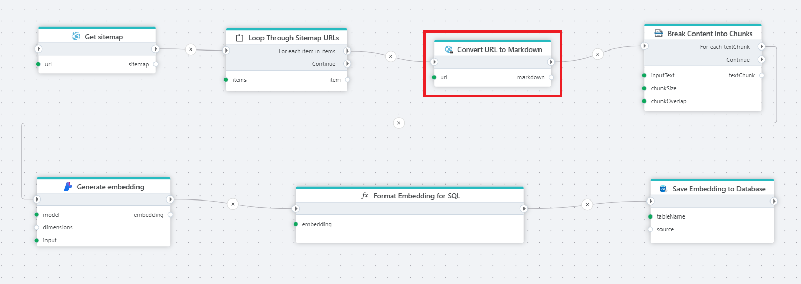

# Convert a URL address to Markdown

Returns [Markdown](https://en.wikipedia.org/wiki/Markdown) text from a URL (HTML page address).

**Example**   
This Flow reads all URLs from a [website sitemap](get-sitemap.md), converts the HTML of [each](../built-in/foreach.md) page to Markdown, [splits the content](../ai/split-text.md) into manageable chunks, [generates embeddings](../azure-ai/generate-embedding.md) for each chunk, converts the generated vector into a SQL Server-compatible format and stores the text, vector, and document reference in a SQL Server table. This table can then be used for [vector search](../postgresql/vector-search.md) or to feed chat models with the extracted information.

 

## Returns

This action returns a string/text in markdown format.

 

## Properties

| Name                 | Type     | Description                                                       |
| -------------------- | -------- | --------------------------------------------------- |
| Title                | Optional |   The title of the action.                    |
| URL                  | Required | Specifies the addresse to a web page.                        |
| Result variable name | Required | The name of the variable in which the result will be stored.  |
| Description          | Optional | Additional notes or comments about the action or configuration. |

 

 

[!INCLUDE ]