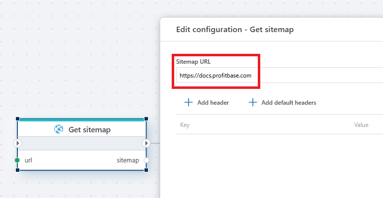
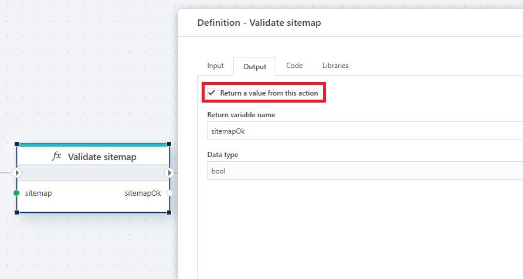
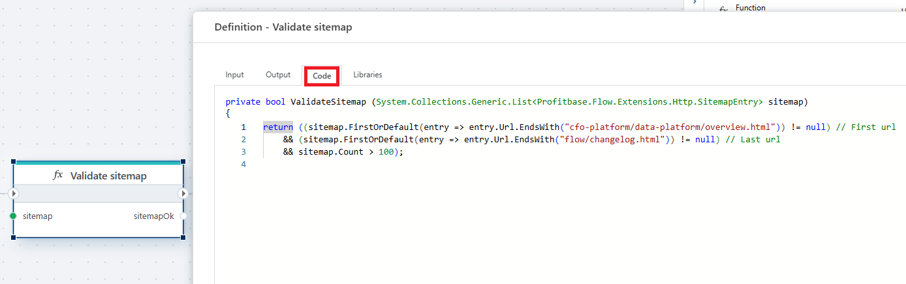

# Get Sitemap

Gets the sitemap from a URL.


**Example**   
This flow retrieves a **sitemap** from a specified URL, [validates](../built-in/if.md) its structure and content, and [throws an exception](../built-in/throw-exception.md) if the validation fails.

<br/>

## Properties

| Name                 | Type      | Description |
|----------------------|----------|-------------|
| Title           | Optional | The name of the operation for retrieving the sitemap. Default: "Get sitemap". |
| Sitemap URL     | Required | The URL of the sitemap to be fetched. The user needs to provide a value. If the provided URL does not contain or end with an XML file containing the sitemap (e.g., `yourwebsite.com`), `"sitemap.xml"` is automatically appended. If the URL ends with `".xml"` (e.g., `yourwebsite.com/sitemap-file.xml), it is regarded as the sitemap.
 |
| Result variable name | Optional | The name of the variable where the retrieved sitemap will be stored. Default: "sitemap". |
| Description     | Optional | A field for adding additional details about the operation. |
| Authentication  | Optional | Specifies authentication details needed to access the sitemap, if applicable. |

<br/>

## Returns

### `List<SitemapEntry>`

A list containing entries representing pages found in the sitemap.


### `SitemapEntry`
```csharp
SitemapEntry {
    Url: string,
    LastModified: DateTime,
    ChangeFrequency: ChangeFrequency
}
```

ChangeFrequency

Defines how frequently the content at the URL is likely to change.

```csharp

ChangeFrequency {
    Always,
    Hourly,
    Daily,
    Weekly,
    Monthly,
    Yearly,
    Never
}
```
<br/>

## Detailed description of the Flow example:

This flow is designed to automatically verify the integrity and completeness of a website’s sitemap and alert the user if it doesn’t meet defined criteria.  
The flow consists of four main actions:

1. **Get sitemap** – Downloads the sitemap from the provided URL (in this case, https://docs.profitbase.com) and outputs it as the variable sitemap.



2. **Validate sitemap**  


<br/>

The result of this validation is returned as a boolean variable sitemapOk.



<br/>

A custom [function](../built-in/function.md) that checks the sitemap’s content. It verifies that:
- It includes a URL ending with cfo-platform/data-platform/overview.html (the expected first URL),
- It includes a URL ending with flow/changelog.html (the expected last URL),
- The sitemap contains more than 100 entries.



<br/>

3. **Check sitemap** – Evaluates whether sitemapOk is true. If so, the flow continues. If false, it triggers an exception.


4. **Throw exception** – If the sitemap validation fails, this action raises an error with the message “Sitemap validation failed.”


<br/>

[!INCLUDE [](./__videos.md)]