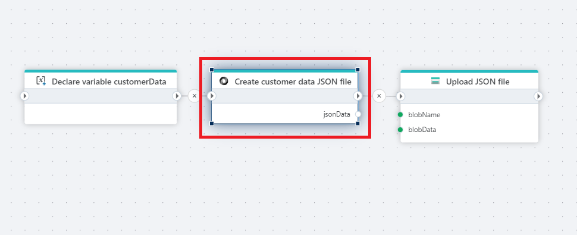

# Create JSON file as byte array

Creates a JSON file from a [string](https://learn.microsoft.com/en-us/dotnet/api/system.string) and returns the result as a byte array.

 

 

## Returns

Returns the JSON file serialized as a [byte](https://learn.microsoft.com/en-us/dotnet/api/system.byte) [array](https://learn.microsoft.com/en-us/dotnet/csharp/language-reference/builtin-types/arrays)

 

## Properties

| Name                     | Type     | Description                 |
| ------------------------ | -------- | --------------------------- |
| Title                    |          |                             |
| JSON string                   | Required | A JSON-formatted string that provides the data. |
| Result variable name     | Optional | The name of the byte array variable returned from the action.                             |
| Description              | Optional |  Additional notes or comments about the action or configuration. |
