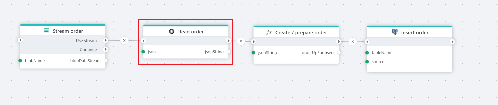

# Read JSON file as string

Reads a JSON file [byte](https://learn.microsoft.com/en-us/dotnet/api/system.byte) [array](https://learn.microsoft.com/en-us/dotnet/csharp/language-reference/builtin-types/arrays) or [stream](https://learn.microsoft.com/en-us/dotnet/api/system.io.stream)and returns the result as a [string](https://learn.microsoft.com/en-us/dotnet/api/system.string).

 

 

## Returns

[string](https://learn.microsoft.com/en-us/dotnet/api/system.string)

## Properties

| Name                     | Type     | Description                 |
| ------------------------ | -------- | --------------------------- |
| Title                    |          |                             |
| JSON                     | Required | A JSON-formatted byte array or stream that provides the data. |
| Result variable name     | Optional | The name of the string variable.                             |
| Description              | Optional |  Additional notes or comments about the action or configuration. |
