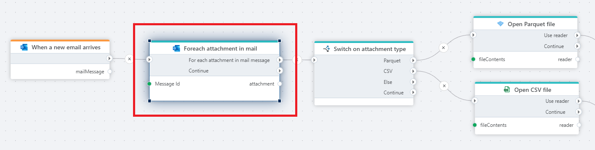

# For each attachment

Iterates over the attachments in an email in Microsoft 365 Outlook.

Use this action to get all file attachments from an email in Microsoft 365 Outlook and process them one by one.

## Properties

| Property      | Type     | Description                                                                                                             |
| ------------- | -------- | ----------------------------------------------------------------------------------------------------------------------- |
| Connection    | Required | A [Microsoft 365 Outlook connection](./outlook-connection.md) which grants Profitbase Flow access to the email account. |
| Message Id    | Required | The id of the email message that contains the attachment. You can get the id of the message from the `output` of actions or triggers returning email messages, for example the [When a new email arrives](../../triggers/microsoft-365-outlook/when-new-email-arrives-trigger.md) trigger.                                                              |
| Email account | Optional | Specify the email account only if you are getting attachments from a `shared mailbox`, for example `support@corp.com`. To get attachments from email messages in shared mailboxes, the Outlook API requires the email account to be specified, or else it assume that you to fetch data from the email account specified as logon for the Connection. |

 

[!INCLUDE ]